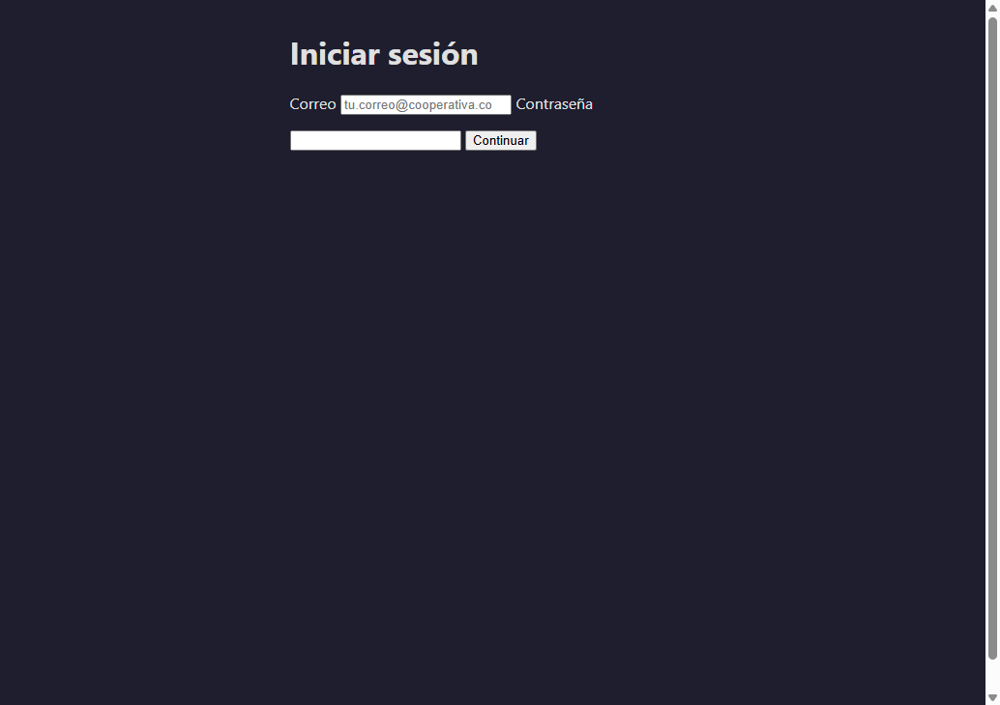
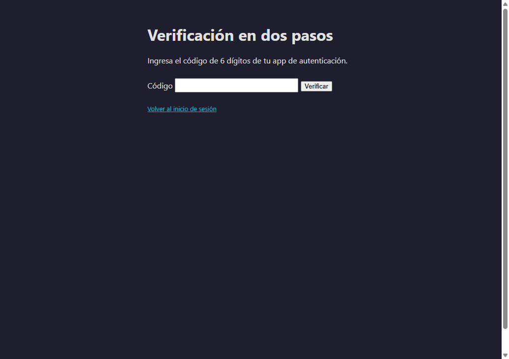
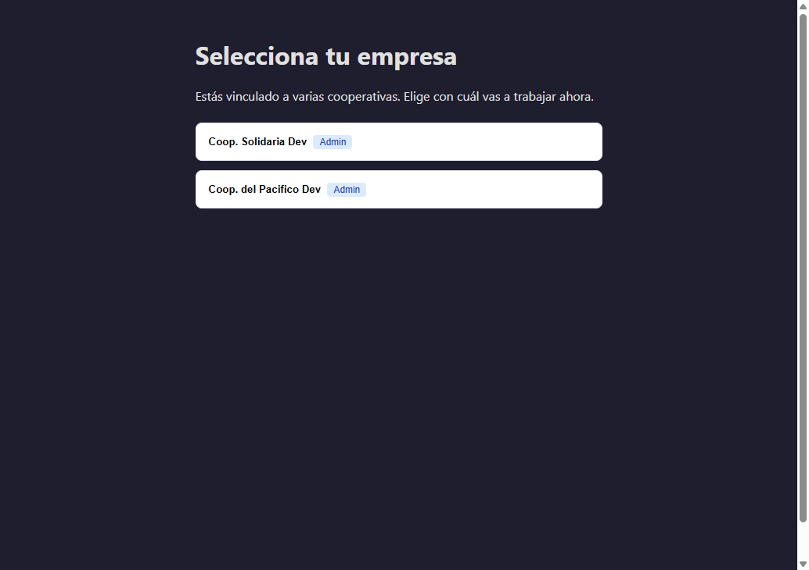
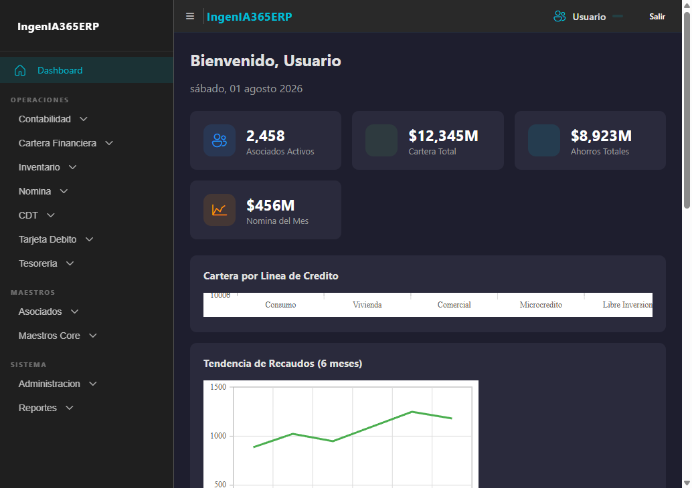
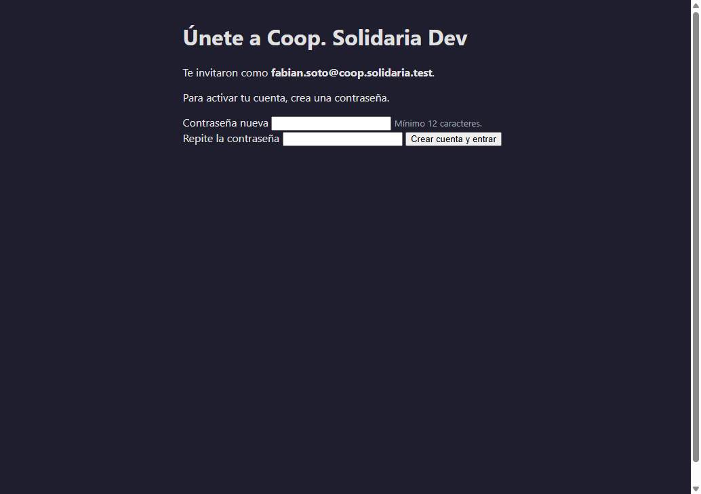
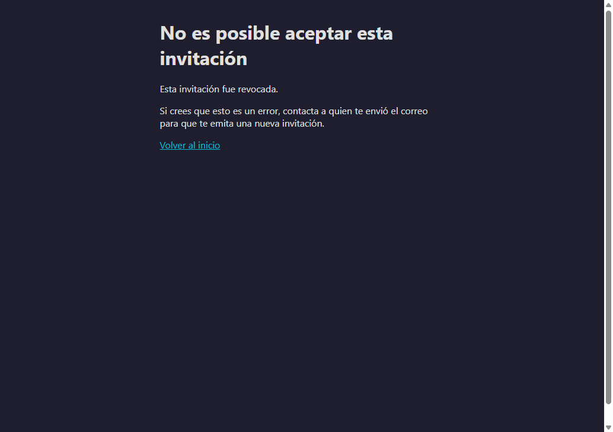
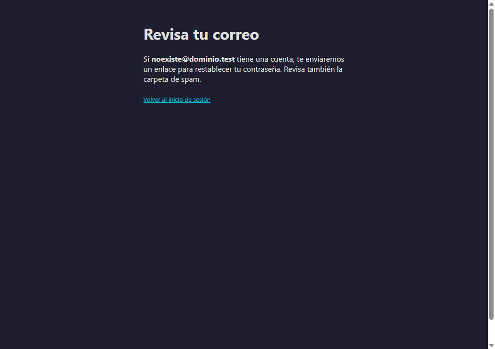
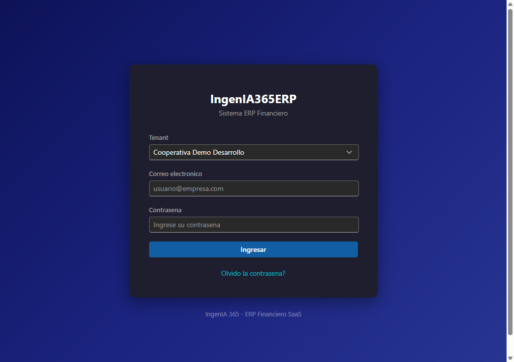

# Evidencia de pruebas — Feature 002: Identidad Central Federada

> **T127** — Ejecución end-to-end del feature contra el entorno dev local
> (SQL Server + MongoDB nativos, Redis WSL2, smtp4dev, API en 5100, Web en
> 5200), con captura de evidencia por user story.
>
> **Fechas de ejecución**: 2026-07-26 (US1/US2 pasos 1–6) y
> 2026-07-31 / 2026-08-01 (Phase 4b, US3, US4, US5, jobs, UI y cutover).
> **Rama**: `002-identidad-central-federada`.

---

## 1. Resumen ejecutivo

| Bloque | Método | Resultado |
|---|---|---|
| US1 — Onboarding por invitación | curl + UI | ✅ emisión, correo, preview, accept (rama nueva y sesión-activa), replay 410, revocación |
| US2 — Login centralizado | curl + UI | ✅ mono-tenant directo, lockout progresivo, FR-041 anti-enumeración, master operacional |
| Phase 4b — Profile & Recovery | curl + UI | ✅ change/forgot/reset password, MFA voluntario, enrollment forzado con elevación de sesión, política MFA |
| US3 — Multi-empresa | curl + UI | ✅ TenantSelection, select con challenge token, switch en sesión, default tenant |
| US4 — Admin de empresa | curl | ✅ listar miembros, suspender/reactivar, salvaguarda último admin, política MFA con auditoría |
| US5 — Master admin | curl | ✅ force-MFA-reset con razón obligatoria e invalidación de refresh tokens |
| Phase 8 — Background jobs | SQL + polling | ✅ InvitationExpiry (tick ~2 min) y PasswordResetTokenCleanup (tick ~5 min) |
| Auditoría Mongo (FR-032/033/003d) | mongosh | ✅ eventos por-tenant y globales verificados en cada bloque |
| Cutover UI del login (T077) | Playwright | ✅ `/login` central sin combo → MFA → dashboard sin rebote → logout |

**Suites automatizadas al cierre**: `Application.Tests` 180/180 ·
`Architecture.Tests` 34/34 · compilación 0 errores (API, Web, Web.Client,
Shared, App MAUI).

## 2. Bugs encontrados y corregidos durante la ejecución

1. Refresh tokens sobrevivían al cambio/reset de contraseña y al
   force-MFA-reset → `SecurityStamp` en `CentralRefreshSession` + comparación
   en el refresh (commit `55eda3c`).
2. El refresh emitido por accept-invitation nunca se persistía (token
   muerto) → se almacena en el store (commit `55eda3c`).
3. Forgot password daba 500 → mapeo EF de `PasswordResetToken` +
   migración de esquema (commits `fde78e4`, gaps formalizados en
   `26b_Backfill_Gaps_Admin.sql`).
4. El enrollment forzado de MFA era inalcanzable y el master no podía operar
   `/api/tenants/*` → exenciones y fallback en `TenantResolutionMiddleware`
   (commit `db3d2e8`).
5. El host Web no registraba los clientes de identidad (500 en prerender) y
   los parsers UI no manejaban 204 → registrados + guard (commit `8799680`).
6. La sesión central no puenteaba con la auth de la app y `/login` servía el
   login viejo con combo → cutover T077 (commit `1a1d6ac`).

## 3. Evidencia visual (UI Web)

Capturas tomadas con Playwright contra `http://localhost:5200`
(perfil `http`).

| # | Captura | Qué demuestra |
|---|---|---|
| 1 |  | **US2/SC-001/FR-007**: `/login` sirve el login central — solo correo y contraseña, sin combo de cliente. |
| 2 |  | **FR-003**: tras credenciales válidas, challenge TOTP obligatorio para usuaria con MFA activo. |
| 3 |  | **US3/FR-014**: usuaria multi-empresa sin default ve exactamente sus 2 cooperativas activas. |
| 4 |  | **FR-013/020**: tras seleccionar, dashboard operativo completo con la sesión central (sin rebote). |
| 5 |  | **US1/FR-029(a)**: enlace de invitación reconoce identidad nueva y pide crear contraseña (mín. 12, FR-043). |
| 6 |  | **FR-031**: el mismo enlace, tras revocación del admin, queda invalidado con mensaje claro. |
| 7 |  | **FR-041**: respuesta genérica idéntica exista o no el correo (anti-enumeración). |
| 8 |  | Referencia: el login viejo de Fase 0 (con combo de tenant) queda archivado en `/legacy-login`. |

## 4. Evidencia técnica complementaria (curl / SQL / Mongo)

- **Replay de invitación**: segundo `POST /api/invitations/accept` con el
  mismo token → `410 Invitation.AlreadyAccepted` (FR-030/SC-009).
- **Reset consumido**: segundo `POST /api/auth/password/reset` →
  `422 Profile.PasswordReset.AlreadyConsumed`.
- **Refresh post-cambio de contraseña**: rechazado con
  `Identity.RefreshToken.Invalid` y familia invalidada (fix #1).
- **Salvaguarda último admin**: auto-degradación →
  `422 Membership.SelfDemoteBlocked.LastAdmin`; con segunda admin → 204
  (FR-040/SC-012).
- **Política MFA**: `TenantMfaPolicy.Activated/Deactivated` en la colección
  Mongo del tenant con actor y timestamp (FR-003d); miembro sin MFA →
  `challenge=MfaEnrollmentRequired` sin access token (FR-003b).
- **Force-MFA-reset**: razón < 10 chars → `400 Validation.Invalid`; con razón
  válida → 204 + `CentralUser.MfaResetByMaster` en Mongo con la razón, MFA
  limpiado y refresh tokens del afectado invalidados (US5).
- **Sesiones**: `Session.TenantSelected` / `Session.TenantSwitched` en las
  colecciones per-tenant (FR-033/SC-011); JWT post-switch con
  `active_tenant_id` del tenant destino, `tenant_admin` y `purpose=full`.
- **Jobs**: invitación con `ExpiresAt` retro-datado pasó a `Expired` en el
  tick (~2 min tras arranque) con evento `Invitation.Expired`; tokens de
  reset consumidos >30 días purgados en el tick de ~5 min.

## 5. Pendientes conocidos al cierre de esta evidencia

- Persistencia de sesión ante F5 (storage in-memory pre-existente en Web/WASM).
- `PermissionGate` con claims de permisos por tenant (`GET /me`).
- TenantSwitcher del header (T091) y header con email real.
- Tests T118 (integration master-register-tenant) y T124 (carga NBomber).
- Observaciones de seguridad en discusión: accept emite token full con
  política MFA activa; timing side-channel en forgot; etiqueta `otpauth://`
  con GUID; `GET /members` sin emails; colección Mongo `audit_events_` para
  eventos globales.
